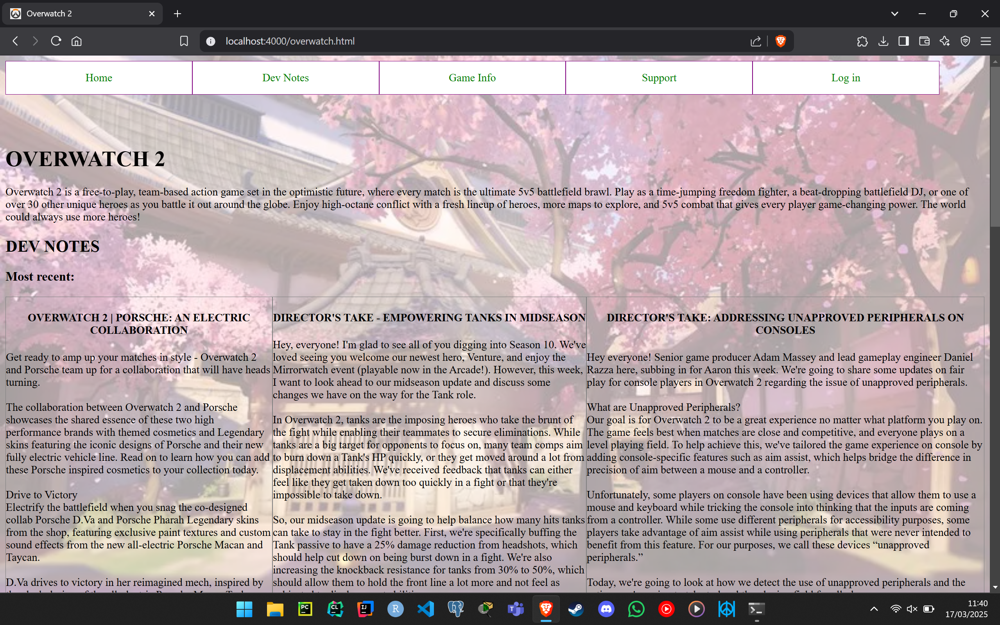
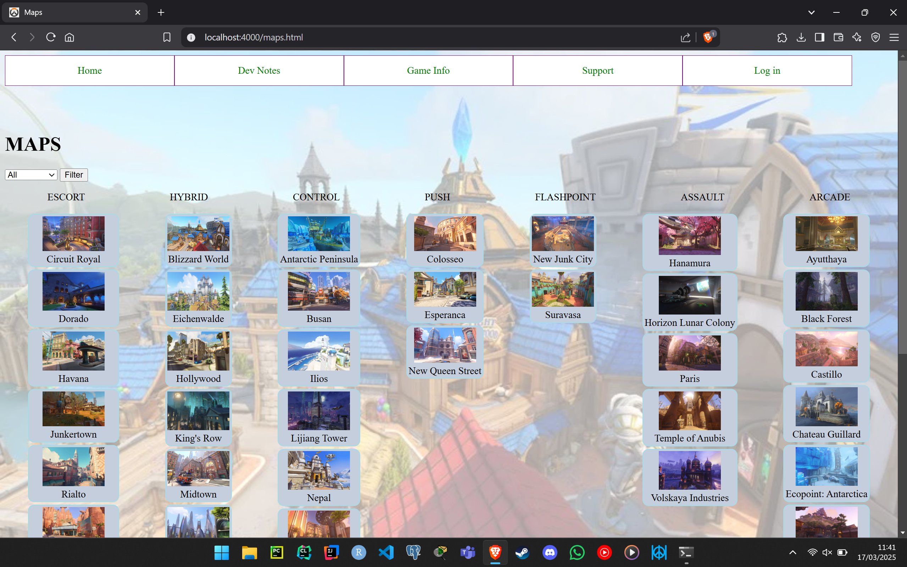
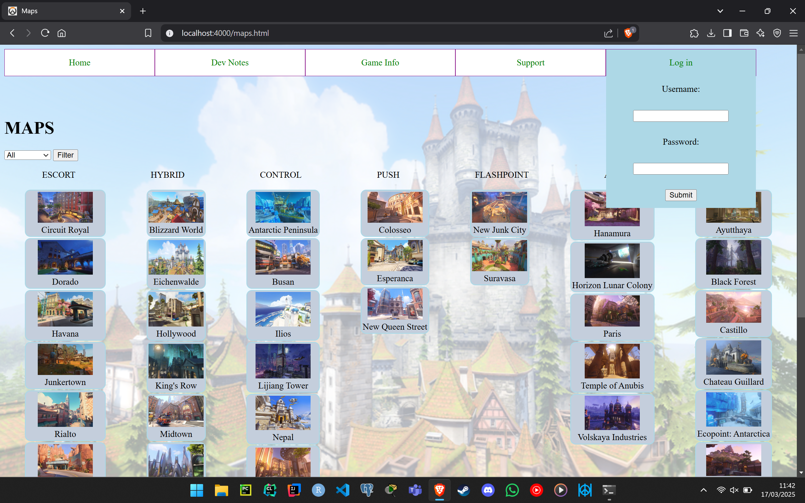

# Overwatch website - HTML, CSS, JS, Node
## Tehnici Web (2023-2024)

## Table of contents
+ [Description](#description)
+ [Requirements](#requirements)
+ [Setup](#setup)
+ [Pictures](#pictures)

> Last hero added: Venture (16.04.2024)  
> Last map added: Samoa (10.10.2023)

### Description

+ Dynamic website with a pseudo-login system using local storage and regex validation. It features a sticky dropdown menu,
alternating backgrounds, and transitions and animations.
+ It offers users the option to read the latest Dev Notes, to view all maps and filter them based on gamemode, to view all heroes, read descriptions about them and select favorites, to login, to contact Blizzard Support, to subscribe to the newsletter, and to change the theme of the website \(light, dark, random\). 
### Requirements

+ Check if you have Node installed \(`node -v`\). If not, install it from this [page](https://nodejs.org/en).
+ Check if you have Nodemon installed \(`nodemon -v`\). If not, install it locally using this command: `npm install --save-dev nodemon`

### Setup

+ `git clone https://github.com/mateiungureanu/TW-2023-proiect.git`
+ `cd TW-2023-proiect`
+ `npm install`
+ `npx nodemon app_proiect.js`
+ Go to http://localhost:4000/overwatch.html

### Pictures

